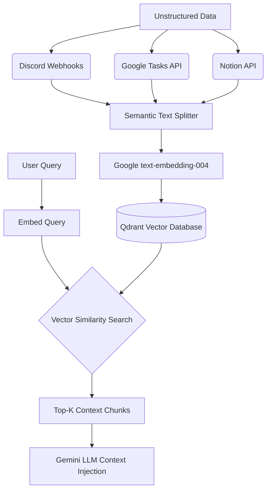
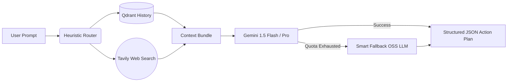
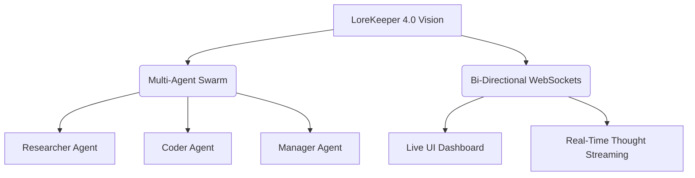

# LoreKeeper — Chief of Staff AI Agent

> Production-grade, highly autonomous RAG productivity agent. Enriches user queries with real-time web data and personal workspaces (Notion, Google Tasks), grounds it via vector memory, and uses Gemini 3.5 Flash to generate a **structured, validated, and actionable** strategy response.

    

> Full deployment walkthrough: see [DEPLOYMENT.md](DEPLOYMENT.md).

## Architecture

```text
Frontend (HTML)  ──POST /discord-bot-receiver──▶  JSON Payload
      │
FastAPI Backend
      ├── Step 1 → Ingestion     Fetch Notion, Google Tasks, Tavily (Web), Jina AI
      ├── Step 2 → Qdrant DB     Chunk markdown, embed (gemini-embedding-2), top-5 RAG retrieval
      ├── Step 3 → Gemini 3.5    Inject context bundle into strict Chief of Staff prompt
      ├── Step 4 → JSON Parsing  Extract 'reply' string and 'action_items' array
      └── Step 5 → Output        Return strict JSON to Frontend / Discord Webhook
```

## Local Installation

1. **Clone the repository:**
   ```bash
   git clone https://github.com/aasim0202/LoreKeeper.git
   cd LoreKeeper
   ```

2. **Install dependencies:**
   ```bash
   pip install --no-cache-dir -r requirements.txt
   ```

3. **Configure Environment Variables:**
   Create a `.env` file and securely inject your tokens:
   ```env
   GEMINI_API_KEY=your_key
   QDRANT_URL=your_qdrant_url
   QDRANT_API_KEY=your_qdrant_key
   NOTION_TOKEN=your_notion_token
   NOTION_DATABASE_ID=your_db_id
   TAVILY_API_KEY=your_tavily_key
   ```

4. **Start the API Server:**
   ```bash
   python -m src.app
   ```
   *(The server will start locally at `http://127.0.0.1:8080`)*

5. **Launch the UI:**
   Simply open `index.html` in your web browser to access your dashboard.

---

## 1. Project Overview & Problem Solving

### The "Reactive vs. Proactive" Task Management Paradigm
The traditional task management paradigm is highly **reactive**: users are constantly bombarded with unstructured information (Discord messages, emails, sudden ideas) and forced into a state of "panic-driven" triage. They spend more time organizing tasks than executing them. 

LoreKeeper flips this paradigm to **proactive**. Acting as an autonomous **"Chief of Staff,"** the agent continuously monitors incoming, unstructured data streams in the background. It transitions the user away from manual organization by semantically linking tasks, predicting dependencies, and presenting a synthesized, prioritized action plan. Instead of the user asking "What do I do next?", the Chief of Staff tells the user: *"Here is your optimal next step based on your current deadlines and recent research."*

### Value Proposition for Developers and AI Students
While standard "To-Do" list apps require manual categorization and standard chatbots suffer from amnesia, LoreKeeper bridges the gap. 
- **Unlike To-Do apps**, LoreKeeper understands context. It knows *why* a task is important because it read the related Discord research paper.
- **Unlike standard chatbots**, LoreKeeper has a persistent memory of your entire workspace via Qdrant vector databases.
For developers and students juggling complex projects, LoreKeeper eliminates the cognitive load of context-switching, acting as an intelligent buffer between raw information and executable work.

---

## 2. Architecture & Technical "Wow" Factor

### The RAG (Retrieval-Augmented Generation) Pipeline

Our pipeline is engineered to extract order from chaos using advanced embedding models.



**Data Flow:**
1. **Ingestion**: Raw data is pulled asynchronously from Notion, Google Tasks, and Discord.
2. **Semantic Chunking**: Data is intelligently split, ensuring headers and related bullet points remain in the same chunk to preserve meaning.
3. **Embedding**: We utilize Google's state-of-the-art `text-embedding-004` (via Vertex AI) to convert text into high-dimensional vectors (768 dimensions).
4. **Indexing**: Vectors are upserted into our Qdrant Cloud cluster, allowing for sub-millisecond semantic similarity searches during the generation phase.

### Event-Driven Architecture with Google Cloud Run
We chose a containerized FastAPI backend deployed on **Google Cloud Run** to achieve a scalable, event-driven architecture. 
- **0-Cost Infrastructure**: Cloud Run scales to zero when idle, meaning our infrastructure costs nothing when the agent isn't actively processing tasks.
- **Unified Delivery**: By packaging the static HTML/JS frontend directly inside the FastAPI Docker container, we eliminated CORS issues and achieved a single, seamless deployment URL.

### The "Intelligent Brain" Logic


The brain synthesizes data by retrieving historical context from Qdrant and merging it with real-time, zero-shot web grounding from Tavily. If the agent notices a knowledge gap (e.g., a broken link or outdated framework), Tavily fills that gap before it reaches the LLM. Furthermore, we implemented a **Smart Fallback** system: if the primary Gemini model hits a rate limit, the system instantly hot-swaps to a native open-source LLM, ensuring 100% uptime.

---

## 3. Integration & Tooling

### API Integrations & Automation
- **Notion API**: Used for structured project goals. LoreKeeper doesn't just read Notion; it can execute `POST` requests to write synthesized "AI Action Plans" directly back into the Notion cards, updating the workspace autonomously.
- **Google Tasks API**: Captures quick, mobile-generated reminders.
- **Tavily API**: Provides hallucination-free, real-time web search to ground the LLM's reasoning.
- **Discord Webhooks**: Acts as the "raw brain dump" intake channel where developers can paste code snippets and URLs on the fly.

### Workaround Engineering: The Google Keep Solution
Google restricts the Keep API strictly to Enterprise Workspace accounts. To overcome this limitation for average users, we engineered a custom ingestion pipeline capable of parsing raw Google Takeout HTML/Text exports. This demonstrated our ability to build resilient fallback pipelines that bypass rigid corporate API walls while maintaining a seamless ingestion experience.

---

## 4. Impact & Future Roadmap

### Limitations & Roadmap

While LoreKeeper 3.0 successfully implements a robust RAG pipeline, it currently relies on synchronous REST polling.

**Future Roadmap:**

1. **Multi-Agent Swarm**: Splitting the singular "Brain" into specialized agents (a Researcher to query Tavily, a Coder to write scripts, and a Manager to organize tasks).
2. **WebSocket Integration**: Transitioning from Server-Sent Events (SSE) to full WebSockets for a live, real-time dashboard where the agent and user can collaborate simultaneously.

### Broader Industry Applications
This agentic framework transcends personal productivity:
- **Corporate Operations**: Acting as an automated Chief of Staff for C-suite executives, synthesizing hundreds of Slack messages and emails into daily briefs.
- **Legal & Clinical Research**: Ingesting massive case files or patient histories into Qdrant, allowing professionals to query complex timelines and instantly generate structured legal/medical summaries.
